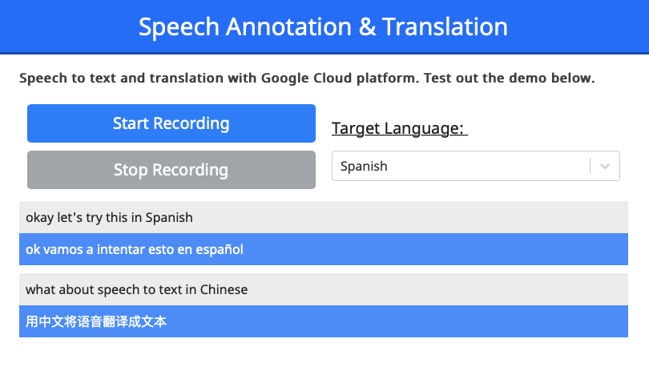

# Live Translate Annotations

[](https://opensource.org/licenses/MIT)

Using Google Cloud APIs, live translate audio into either subtitles or translated audio.



## Installation

#### Google Cloud dependencies

For Google Cloud to connect to your account credentials, an environment variable must be set to point to a JSON file with your credentials.

To create the file and set the environment key:

*  First create JSON service account key file following the instructions [here](https://support.google.com/a/answer/7378726?hl=en).
*  Then, following the steps on the [Google quickstart page](https://cloud.google.com/speech-to-text/docs/quickstart-client-libraries?authuser=1) set the environment variable `GOOGLE_APPLICATION_CREDENTIALS` to the path to your JSON file.

For example on Unix:
```export GOOGLE_APPLICATION_CREDENTIALS=/path/to/creds.json```

### Speech Processing Server

Server written in Node.js. Collects, audio fragments, translates them, and upon a response from Google Cloud, responds with text from audio and translated text.

    cd speech_processing/
    yarn install
    yarn start

### Speech Processing Interface

Interface written using React.js and uses react-select library.

    cd interface/
    yarn install
    yarn start


